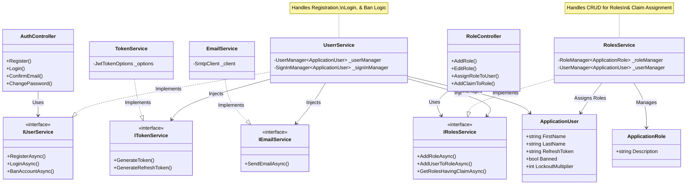

```mermaid
classDiagram
    %% Domain Entities
    class ApplicationUser {
        +string FirstName
        +string LastName
        +string RefreshToken
        +bool Banned
        +int LockoutMultiplier
    }
    class ApplicationRole {
        +string Description
    }

    %% Controllers
    class AuthController {
        +Register()
        +Login()
        +ConfirmEmail()
        +ChangePassword()
    }
    class RoleController {
        +AddRole()
        +EditRole()
        +AssignRoleToUser()
        +AddClaimToRole()
    }

    %% Service Interfaces
    class IUserService {
        <<interface>>
        +RegisterAsync()
        +LoginAsync()
        +BanAccountAsync()
    }
    class IRolesService {
        <<interface>>
        +AddRoleAsync()
        +AddUserToRoleAsync()
        +GetRolesHavingClaimAsync()
    }
    class ITokenService {
        <<interface>>
        +GenerateToken()
        +GenerateRefreshToken()
    }
    class IEmailService {
        <<interface>>
        +SendEmailAsync()
    }

    %% Service Implementations
    class UserrService {
        -UserManager~ApplicationUser~ _userManager
        -SignInManager~ApplicationUser~ _signInManager
    }
    class RolesService {
        -RoleManager~ApplicationRole~ _roleManager
        -UserManager~ApplicationUser~ _userManager
    }
    class TokenService {
        -JwtTokenOptions _options
    }
    class EmailService {
        -SmtpClient _client
    }

    %% Relationships
    AuthController --> IUserService : Uses
    RoleController --> IRolesService : Uses

    UserrService ..|> IUserService : Implements
    RolesService ..|> IRolesService : Implements
    TokenService ..|> ITokenService : Implements
    EmailService ..|> IEmailService : Implements

    UserrService --> ITokenService : Injects
    UserrService --> IEmailService : Injects
    UserrService --> IRolesService : Injects
    
    UserrService --> ApplicationUser : Manages
    RolesService --> ApplicationRole : Manages
    RolesService --> ApplicationUser : Assigns Roles

    note for UserrService "Handles Registration,\nLogin, & Ban Logic"
    note for RolesService "Handles CRUD for Roles\n& Claim Assignment"
```
